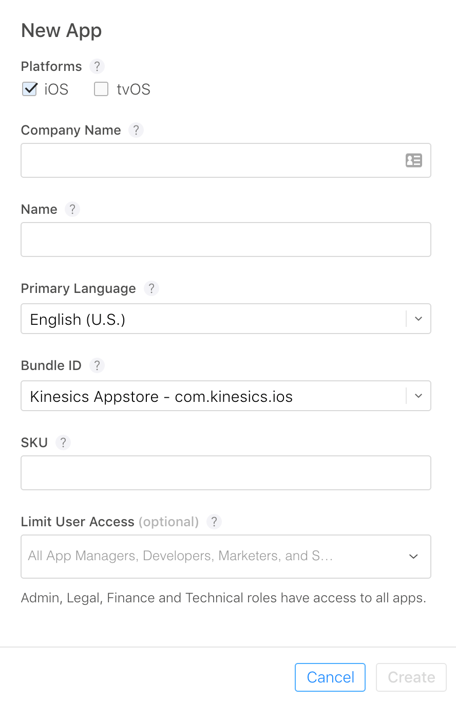
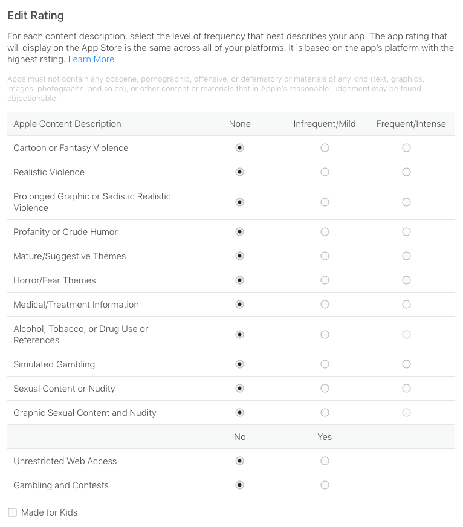
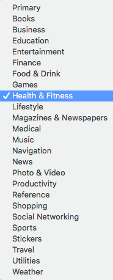
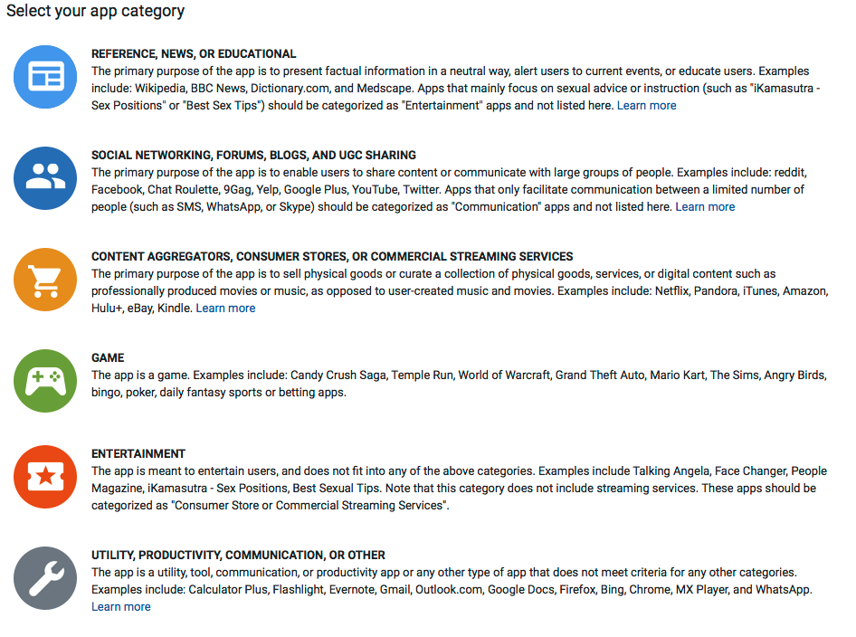
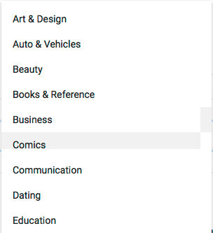
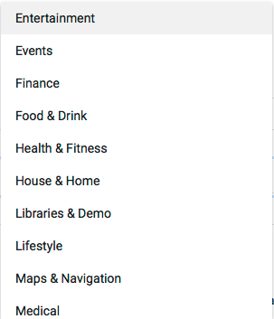
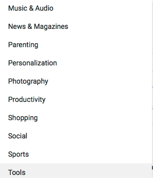
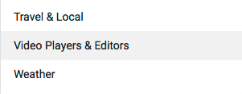
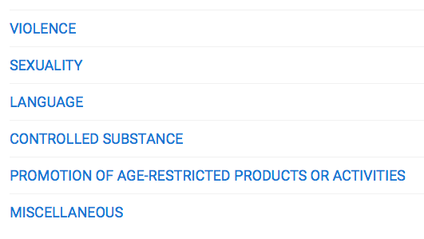

# Mobile

## App Store

### Create a new app

- Company Name - Specify the company name or developer name to display on the App Store for your apps. The company name cannot be changed later. [Learn more](https://itunesconnect.apple.com/itc/Assets/Images/company-name-itunes-image.png)
- Name - The name of your app as it will appear on the App Store. This can't be longer than 30 characters.
- Subtitle - A summary of your app that will appear under your app’s name on the App Store for customers with devices running iOS 11 or later.
- SKU - A unique ID for your app that is not visible on the App Store.
- Privacy Policy URL - A URL that links to your organization's privacy policy. Privacy policies are required for apps that are Made for Kids or offer auto-renewable or free subscriptions. They are also required for apps with account registration, apps that access a user’s existing account, or as otherwise required by law. Privacy policies are recommended for apps that collect user- or device-related data.
- Support URL - A URL with support information for your app. This URL will be visible on the App Store.
- Marketing URL (optional) - A URL with marketing information about your app. This URL will be visible on the App Store.
- Keywords - One or more keywords that describe your app. Keywords make App Store search results more accurate. Separate keywords with a comma.
- Copyright - The name of the person or entity that owns the exclusive rights to your app, preceded by the year the rights were obtained (for example, "2008 Acme Inc."). Do not provide a URL.
- Promotional Text (optional) - Promotional text lets you inform your App Store visitors of any current app features without requiring an updated submission. This text will appear above your description on the App Store for customers with devices running iOS 11 or later.
- Description - A description of your app, detailing features and functionality. It will also be used for your Apple Watch app.
- What’s new in this version - Describe what's new in this version of your app, such as new features, improvements, and bug fixes.
- Rating - This app rating will display on the App Store across all your platforms. It is based on the app's platform with the most mature rating.

### Set Rating (App Store)

### Set Category (App Store)

View category definitions [here](https://itunesconnect.apple.com/itc/static/category_definitions)

You may select 2 categories

## Play Store

You can access the google play store [here](https://play.google.com/apps/publish/).

### Set Rating (Play Store)

### Set Category (Play Store)

### Additional Questions

